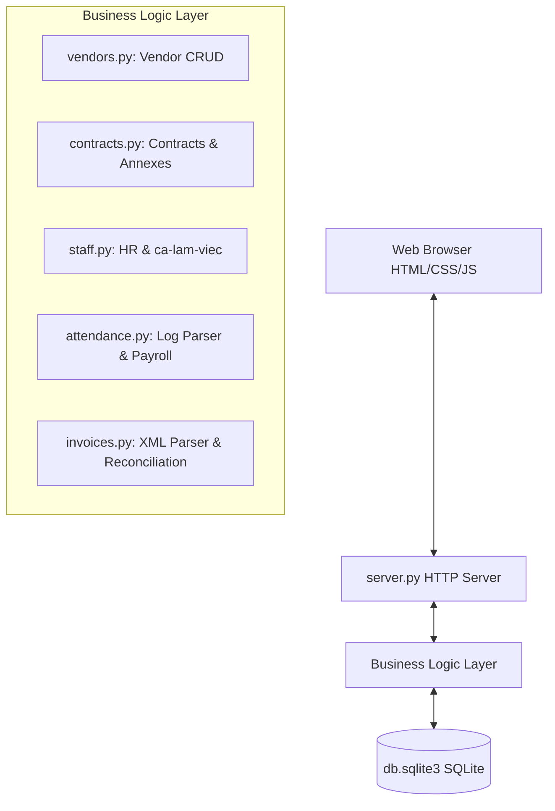
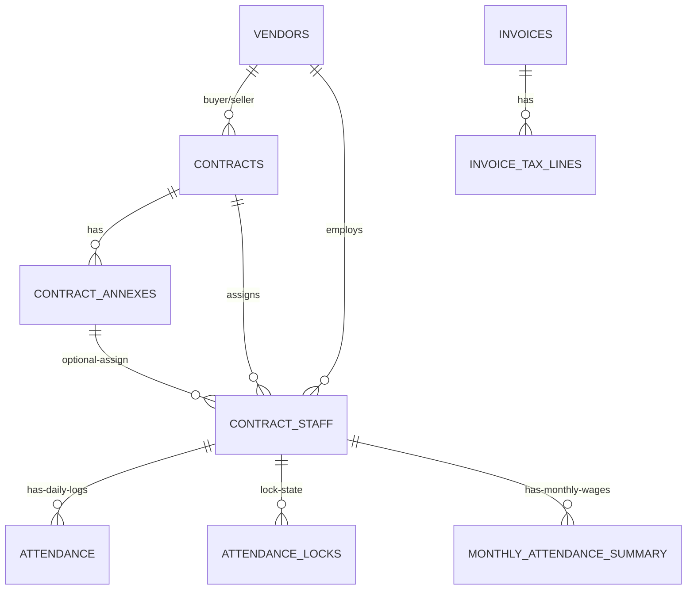

# Mizuho Vendor Management System - System Documentation

This document describes the architecture, database design, core business logic, and validation rules of the Mizuho Vendor Management System. Future developers or AI pair programmers should read this document first before starting any modification or enhancement work.

---

## 🏛️ System Architecture

The application is built entirely as a **zero-dependency** Python web application using Python's standard library and SQLite3.

### Key Technical Specs:
* **HTTP Web Server**: Built on `http.server.HTTPServer` and `BaseHTTPRequestHandler`. Custom routing is handled by dispatching requests based on request paths under `do_GET()` and `do_POST()` methods in [server.py](file:///Users/local/04.working/17.mizuho/vendor_management/server.py).
* **Database**: SQLite3 file-based database [db.sqlite3](file:///Users/local/04.working/17.mizuho/vendor_management/db.sqlite3). Connection pooling/helper logic is defined in [common.py](file:///Users/local/04.working/17.mizuho/vendor_management/common.py#L18-L21).
* **UI Rendering**: Server-side rendering (SSR) of HTML strings styled with a custom CSS template. Dynamic components like attendance grids include embedded Vanilla JavaScript APIs for asynchronous actions (AJAX).
* **Testing**: Python standard `unittest` test cases in [test_app.py](file:///Users/local/04.working/17.mizuho/vendor_management/test_app.py).

---

## 🗄️ Database Design (Schema)

### Table Definitions

#### 1. `vendors`
Stores vendor legal, contact, and banking information.
* `purchasing` (INTEGER): `1` represents Mizuho Bank (the buyer), `0` represents a vendor partner (the seller).
* `is_active` (INTEGER): Soft-delete flag (`1` for Active, `0` for Deactive).

#### 2. `contracts`
Framework contracts between a buyer vendor (`purchasing=1`) and a seller vendor (`purchasing=0`).
* `start_date` & `end_date`: Contract validity period.

#### 3. `contract_annexes`
Optional addendums (annexes) to framework contracts that can adjust contract rates or duration.

#### 4. `contract_staff`
Hires/Resources deployed by vendors to the bank.
* `monthly_rate` (REAL) or `manday_rate` (REAL): Payment rates config.
* `paid_leave_total_hours` & `paid_leave_used_hours`: Tracks annual leave balance.
* `ot` (INTEGER): `1` if the staff member is eligible for automated OT calculation, `0` otherwise.
* `work_shift` (TEXT): Scheduled shift (e.g. `"8:00 - 17:00"` or `"8:30 - 17:30"`).

#### 5. `attendance`
Stores daily working hours.
* `check_in` / `check_out` (TEXT): Logs extracted from face recognition csv files.
* `work_hours` (REAL): Formatted daily work time (usually `8.0` or `4.0` or `0.0`).
* `ot_hours` (REAL): Raw computed daily overtime hours.

#### 6. `attendance_locks`
Freezes daily attendance edits for a specific employee and month.

#### 7. `monthly_attendance_summary`
Aggregated calculations of monthly hours, standard rates, and total amounts.
* `locked` (INTEGER): `1` if monthly calculations are locked (freezing any modifications).

#### 8. `invoices` & `invoice_tax_lines`
Stores parsed XML invoice records and tax line rates for reconciliation.

---

## ⚙️ Core Business Logic & Algorithms

### 1. Date Overlap Validation (`staff.py`)
Before inserting or updating a staff member's active period, the system queries the database to ensure that the worker does not have an overlapping active period under the same vendor:
$$\text{Overlap Condition: } \text{existing\_start\_date} \le \text{new\_end\_date} \quad \text{AND} \quad \text{new\_start\_date} \le \text{existing\_end\_date}$$
Where `tentative_leaving_date` defaults to `'9999-12-31'` if empty.

### 2. Daily Log Import Parsing (`attendance.py`)
Face recognition CSV logs contain raw check-in/out timestamps. The parser normalizes employee names into Unicode NFC format, groups timestamps per person/date, and computes:
* **Lunch Break Subtraction**: If check-in is before 12:00 and check-out is after 13:00 (or total elapsed time exceeds 4.0 hours), 1.0 hour is automatically subtracted for lunch.
* **Work Shifts Conversion**:
  * Net hours $> 6.0 \rightarrow$ Rounded to **8.0 hours** (1 full day công).
  * Net hours $> 3.0$ and $\le 6.0 \rightarrow$ Rounded to **4.0 hours** (0.5 day công).
  * Else $\rightarrow$ **0.0 hours**.
* **Overtime (OT) Automation**:
  * Only calculated if `ot = 1` for the staff member.
  * Baseline end-times: Ca `8:00 - 17:00` ends at `17.0` (17h00), ca `8:30 - 17:30` ends at `17.5` (17h30).
  * If the check-out hour exceeds the shift end-time, the difference is recorded as raw daily OT:
    $$\text{OT Hours} = \text{check\_out\_time} - \text{shift\_end\_time}$$

### 3. Locking Hierarchy Dependencies (`attendance.py`)
To preserve data integrity, the system implements a strict lock relationship:
1. **Daily Attendance Lock**: Daily sheet edits are rejected if the employee's day log is locked.
2. **Monthly Summary Display/Lock Dependency**:
   * A staff member only appears in the Monthly Payroll summary worksheet if their daily attendance for that month is **locked**.
   * A monthly payroll cannot be locked if the daily attendance is unlocked.
3. **Daily Unlock Restriction**:
   * Daily logs cannot be unlocked if the Monthly Payroll summary for that employee is locked.

### 4. Monthly Wage Formulas (`attendance.py`)
* **Daily Rate Calculation**:
  * If `manday_rate` exists: $\text{Daily Rate} = \text{manday\_rate}$.
  * If `monthly_rate` exists: $\text{Daily Rate} = \frac{\text{monthly\_rate}}{\text{standard\_days}}$ (where standard days default to workdays in the month).
* **OT Co-efficient**: Raw OT hours are multiplied by **1.5** when aggregated to Monthly Payroll.
* **Overtime Hourly Rate**: $\text{OT Hourly Rate} = \frac{\text{Daily Rate}}{8}$.
* **Total Payment Computation**:
  $$\text{Total Payment} = (\text{Actual Days} + \text{Paid Leave Days}) \times \text{Daily Rate} + \text{Converted OT Hours} \times \text{OT Hourly Rate}$$

### 5. Annual Leave Check (`attendance.py`)
When manual paid leave days are entered:
$$\text{Paid Leave Hours Input} = \text{Paid Leave Days} \times 8$$
Must be less than or equal to:
$$\text{Remaining Balance} = \text{paid\_leave\_total\_hours} - \text{paid\_leave\_used\_hours}$$

---

## 🔍 XML Invoice Validation & Reconciliation

### 1. Strict 3-Field Party Matching (`invoices.py`)
For imported XML invoices:
* **Buyer Match**: Matches exactly against a vendor with `purchasing=1` on:
  $$\text{Buyer Name (VI)} + \text{Buyer Address (VI)} + \text{Buyer Tax ID}$$
* **Seller Match**: Matches exactly against a vendor with `purchasing=0` on:
  $$\text{Seller Name (VI)} + \text{Seller Address (VI)} + \text{Seller Tax ID}$$
* If any field is mismatched or empty, the table row triggers a pink highlight (`cell-mismatch`).

### 2. Invoice-Payroll Reconciliation (`invoices.py`)
Compares the total invoice amount with the sum of payroll records:
* System queries all active staff assigned to the Hợp đồng / Phụ lục number specified in the invoice.
* Sums the locked monthly amounts: $\text{Locked Sum} = \sum \text{total\_amount}$ for the service month.
* **Match Statuses**:
  * `✓ Match` (Green): Locked Sum matches invoice amount exactly.
  * `⚠️ Mismatch` (Red): Locked Sum does not match invoice amount.
  * `⚠️ Unlocked` (Orange): Unlocked payroll sum matches or exists, but is not locked yet.
  * `No payroll` / `No contract` (Gray): Missing payroll records or no matching contract number.

---

## 🎨 Frontend UI/UX Mechanisms

### 1. Form Double-Click Protection
To prevent accidental duplicate form submissions:
* A global listener catches form `submit` events.
* It automatically disables all submit buttons (`button[type="submit"]`) and changes their text to `"Processing..."` after a 50ms delay.

### 2. Success Alerts
* When a database transaction completes successfully, the template returns a `.card.success` div.
* The frontend JavaScript parses this div's content on `DOMContentLoaded` and displays it using a native browser `alert()` pop-up.

### 3. Contract Dropdown Filters
* In the Monthly Payroll worksheet, the Framework Contract dropdown is intentionally NOT filtered by the selected vendor, allowing cross-vendor framework contract lookups.
* In the Staff registration form, changing the Framework Contract dynamically filters the active Annexes dropdown using `data-contract-id` data attributes.

### 4. Interactive Hover Tooltips
* Daily attendance cells and fingerprint icons include a `title` attribute.
* Hovering over a cell displays a tooltip with the raw check-in/out logs (e.g. `"Fingerprint logs: 07:55 → 17:35"`) so users can audit computed hours against raw times.

